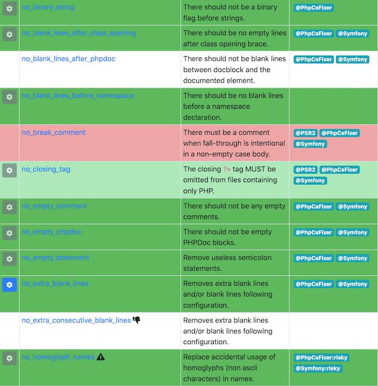

# php-cs-fixer-config

This repository provides configuration for [friendsofphp/php-cs-fixer](http://github.com/FriendsOfPHP/PHP-CS-Fixer), which we use to verify and enforce a single coding standard for PHP code within Fusions PIM.

## Installation

Run `composer require --dev fusionspim/php-cs-fixer-config`.

## Usage

Create a configuration file `.php-cs-fixer.dist.php` in the root of your project:

```php
<?php
return FusionsPim\PhpCsFixer\Factory::fromDefaults();
```

The default rules can be overridden within your project, by passing an optional array:

```php
<?php
return FusionsPim\PhpCsFixer\Factory::fromDefaults([
    'void_return' => false, // We'll do this later since it affects too many closures right now
]);
```

All `.php` files within your project root are checked (other than those in `Factory::DEFAULT_EXCLUDED_DIRS` or named `Factory::DEFAULT_EXCLUDED_NAME`) though `Finder` can easily be reconfigured for your project:

```php
<?php
$config = FusionsPim\PhpCsFixer\Factory::fromDefaults();
$finder = $config->getFinder()->name('*.phtml')->notName('Factory.php');

return $config->setFinder($finder);
```

## Improvements

Pasting `Factory::DEFAULT_RULES` into [the PHP-CS-Fixer Configurator tool](https://mlocati.github.io/php-cs-fixer-configurator) lets you visually check all the available fixers and built-in presets. This helps identify newly introduced rules, and opportunities to tighten (or adopt defaults for) existing rules: 

[](https://mlocati.github.io/php-cs-fixer-configurator)

## Acknowledgements

Inspired by [localheinz/php-cs-fixer-config](https://github.com/localheinz/php-cs-fixer-config) and [refinery29/php-cs-fixer-config](https://github.com/refinery29/php-cs-fixer-config).
